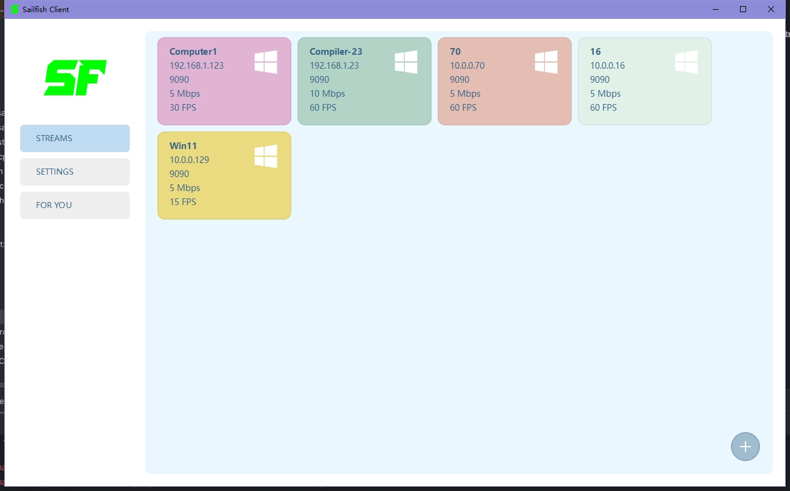
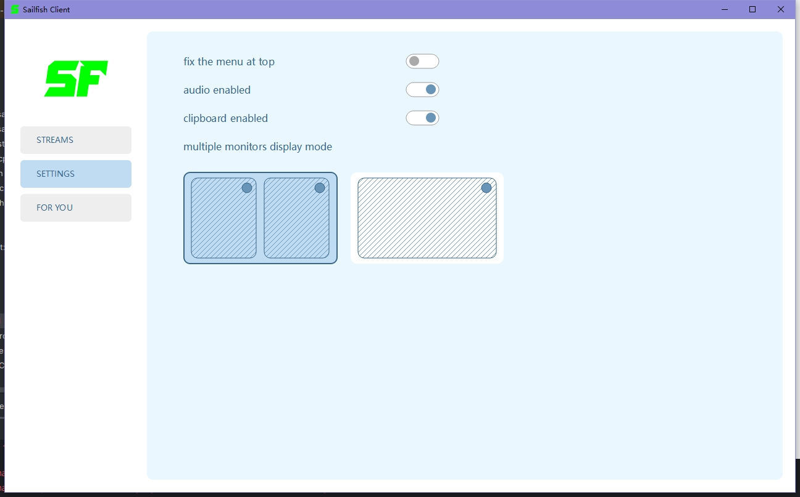
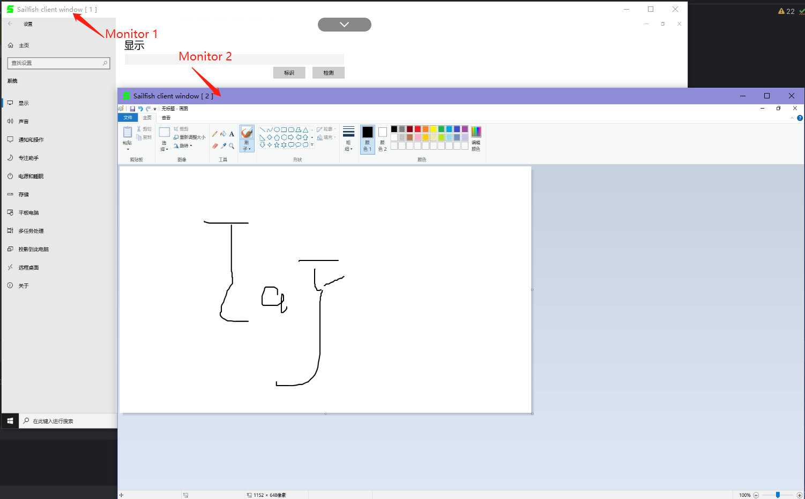
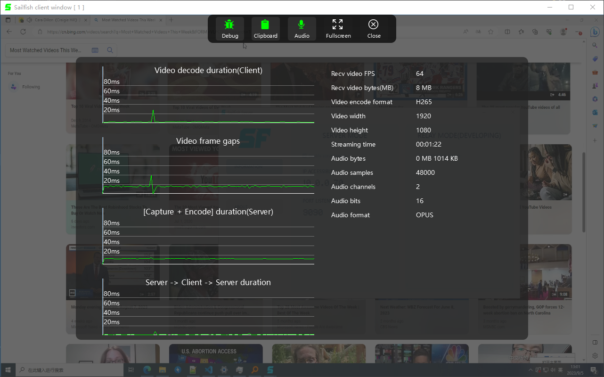

## Sailfish Client
#### TAG: (remote control software) (remote desktop) (远程桌面)
#### This is a PC client for Sailfish Remote Controller. 
#### There are only some screenshots, more information see at here [Sailfish Server](https://github.com/RGAA-Software/sailfish_server)

##### Main ui

##### Settings ui

##### Support 2 monitors 

##### Detail debug information

##### license 
Do what you want to do.